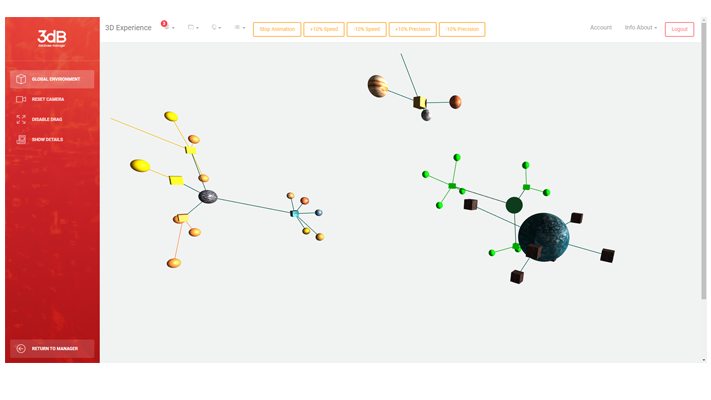

# 3db - Explore database structure in 3D environments.  
> A simple web application integrating an experimental WebGL database explorer written using three.js. 
It was developed by Marzio Monticelli as final project for the course of Interactive Graphics (academic year 2017/2018) at Sapienza, University of Rome. 

The project is based on the idea to develop a 3D Web Service to manage databases and see a 3D representation of the data space through simply web interfaces. 

To read more about this project you can found the final report in ``documentation`` folder. 

## Prupose
This repository is intended for presentation purposes only, therefore neither safety nor actual usability of the developed application has been taken care of since they was not concerned at the end of the final evaluation.

## Installation

Create a folder called 3dB in the root directory of your local server. The local path to the folder you have just created should look like:

```sh
C:\Programs\Apache\htdocs\3dB
```

than copy the content of this reposity in the created folder. 
Finally open your MySql panel and create a new dabase called

```sh
3dbcentral
```

importing in it the database you can found in the documentation folder (3dbcentral.sql).
That's it.

If the installation was successful you should be able to see the welcome page at:

```sh
http://localhost/3dB/
```


## Access

To make the access to the admin panel and see the experimental 3D experience you can use the following credentials:

```sh
email: admin@example.com
password: password
```

Tee following image shows the exploration of 3 different databases created through the user interfaces of the application:




## Release History

* 0.1.0
    * The first proper release
    * The project is for presentation prupose only.
    * There will be no further releases at the moment

## Meta

Marzio Monticelli – marzio.monticelli@gmail.com

Distributed under the MIT license. See ``LICENSE`` for more information.

[https://github.com/MarzioMonticelli/3db](https://github.com/MarzioMonticelli/3db/)
